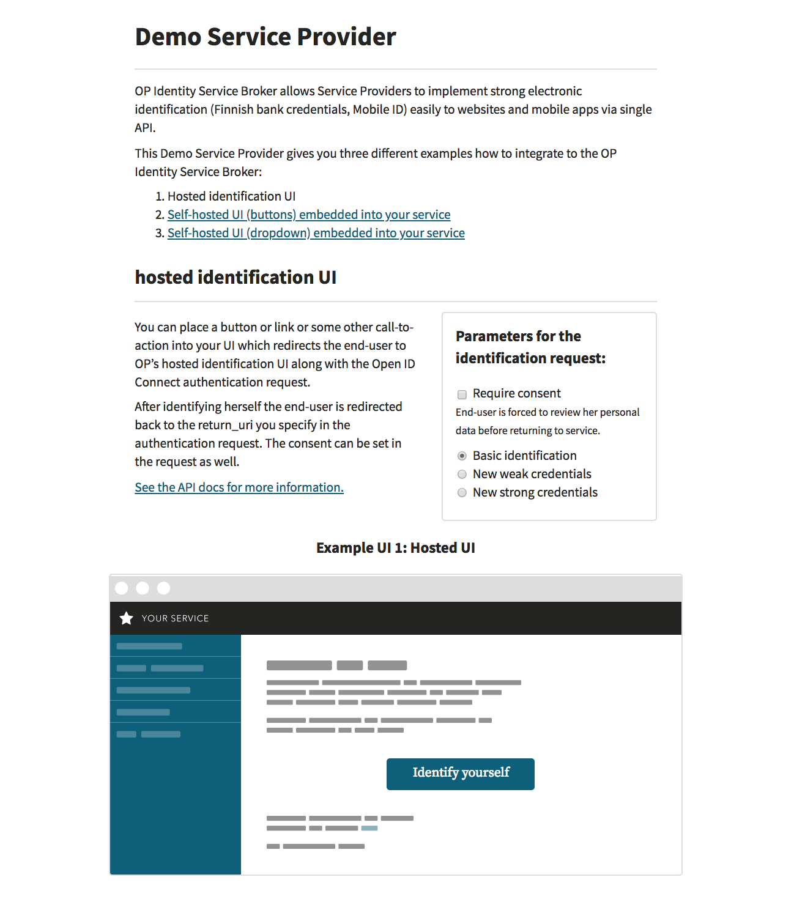

# Service Provider integration example for the OP Identity Service Broker - Java

This repository provides an easy way to test OP identification
services. It also serves as a Java-based implementation example to help Servide Providers (SP) to integrate to the OP Identitity Service Broker (ISB).

This example is the OP Demo Service Provider, which runs as a Spring Boot microservice and it connects with the OP ISB sandbox environment.

This Demo Service Provider gives you two different examples how to integrate to the OP's Identity Service Broker:
- OP's hosted Identification UI
- Embedded identification UI with buttons

## OP's hosted Identification UI

In this example the Identification UI is hosted by the OP's Identity Service Broker. Authorization is started by clicking the "Identify Yourself" - button shown on the UI.

## Embedded identification UI with buttons

In this example the Identification UI is embedded into the Demo Service Provider. Authorization request is sent by clicking one of the Identity Provider buttons shown on the
UI.

## Additional parameters for testing purposes

In all three examples it is possible to select the identification purpose (See the scope-parameter in the flow chapter of the API-document):
- normal
- weak (for weak identifiers, for example user account with user-id and password)
- strong (for official strong authentication)

In your implementation there won't be such selection for the end users. The purpose selection is there to illustrate how it looks like at the code level and in the interface
between the SP and the ISB when the SP is using such purpose. SP needs to use one of these three methods when initiating the identification process with the ISB.

In all three examples it is also possible to select whether consent is required or not (See the consent-parameter in the flow chapter of the API-document). In your
implementation there won't be such selection for the end users. The consent parameter is there to illustrate how it looks like in the code level, in the ISB UI and in the
interface between the SP and the ISB when the SP is requesting consent to be requested from the end users during the identification process. It is up to the SP to decide
during the implementation phase whether to request this consent or not.

There is also language selection. In your implementation there won't be such selection for end users. Instead, it illustrates how you can pass user interface language
in the code level so you can integrate it with the language switching method already present in your interface.

Screenshot for the Service Provider example:



## Requirements
- Recent Java 8 or newer (TLS handshake error means too old Java.)
- Maven
- Port 8080 needs to be free on the host computer

## Documentation

The OP Identity Service Broker (ISB) API-documentation is available here. See https://github.com/op-developer/Identity-Service-Broker-API .

## Java KeyStore (JKS)

This integration example uses JKS. There are three Service Provider's keys (or actually certificates) stored there:
- encryption key
- signing key
- key for signing the Entity Statement and the JWS containing the JWKS of the SP

Since it is not possible to store pure private RSA keys in the JKS self-signed certificates have been created, but the certificates are not used for anything in the implementation.

Commands to add a new certificate in the JKS (example uses sandbox-sp-entity-signing-key.pem which is the RSA key from the API document):

- openssl req -new -key sandbox-sp-entity-signing-key.pem -out cert.csr
- openssl x509 -req -days 3650 -in cert.csr -sha256 -signkey sandbox-sp-entity-signing-key.pem -out server.crt
- openssl pkcs12 -export -in server.crt -inkey sandbox-sp-entity-signing-key.pem -out server.p12 -name sandbox-sp-entity-key
- keytool -importkeystore -deststorepass [add store password here] -destkeystore saippuakauppias.jks -srckeystore server.p12   -srcstoretype PKCS12 -srcstorepass [add password for the source store here] -alias sandbox-sp-entity-key

finally change the password of the key as follows (use same saippuakauppias.jsk store password for the new key and for the store):
- keytool -keypasswd -alias sandbox-sp-entity-key -keystore saippuakauppias.jks


ISB's public Entity Statement signing key is stored in a "sandbox-isb-entity-signing-pubkey.pem" file in the resources. That is used to verify the signing of ISB's JWS containing the ISB JWKS.

## Security limitations

Please note that this integration example demo application has the following identified security issues:
- The following security headers are missing (in production these should be set properly):
    - The anti-clickjacking X-Frame-Options header.
    - The X-XSS-Protection header is not defined. This header can hint to the user agent to protect against some forms of XSS
    - The X-Content-Type-Options header is not set. This could allow the user agent to render the content of the site in a different fashion to the MIME type
    - HTTP Strict-Transport-Security header is not set. This demo application uses http, not https. https has to be used in production and then this header is mandatory
- Cookie is not protected. In production the httpOnly flag must be added to the PHPSESSID cookie.
- The error page is vulnerable to reflected Cross-site scripting. In production there should be input validation and output encoding.
- Demo application information leakage. It is possible to get some details about the system by using malformed input parameters, or in certain case, by calling
the same method again with the same information. Also errors expose details on purpose to help the integration work. In production there should be user input
validations and errors
should not expose details of the system.
- Nonce in ID Token is not checked against the one that was given in oauth/authorize.
- Keys are not periodically rotated.

## Usage

On the host computer give the following commands:

```bash
mvn spring-boot:run
```

When the microservice is up and running, please open the browser and go to the http://localhost:8080
